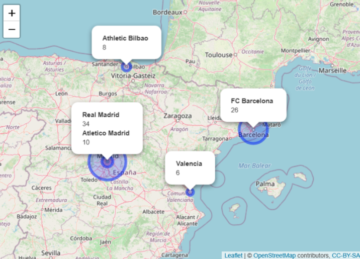

```{r clear_genv, echo=FALSE}
rm(list = ls())
```

```{css setup, echo=FALSE}

        .image {
                display: block;
                margin-left: auto;
                margin-right: auto;
                width: 60%;
        }

        .html-widget {
                margin: auto;
        }

```

<div style="text-align: justify">

### Using the leaflet and htmltools libraries (or others of your choice), create a simple map to represent the historical champions of La Liga. More specifically, the goal of this problem is to obtain the map below or something similar to it:

</div>


<div class="image" id="example">

</div>


<div style="text-align: justify">

### The data needed for this graph is represented below:

| Team            | Champion | City      |
|-----------------|----------|-----------|
| Real Madrid     | 34       | Madrid    |
| FC Barcelona    | 26       | Barcelona |
| Atletico Madrid | 10       | Madrid    |
| Athletic Bilbao | 8        | Bilbao    |
| Valencia        | 6        | Valencia  |

\

In dealing with the type of data that geocoding has, then wrangling the data, then translating that to a map, there are a lot of packages that I used:

</div>

```{r install, echo=TRUE, message=FALSE, warning=FALSE}

# ESCREVER PRAQ SERVE CADA UM

library(htmltools)
library(leaflet)
library(tidyverse)
library(ggmap)
library(sf)
library(mapview)
library(knitr)
#rgdal
#ggplot2
```

<div style="text-align: justify">

For me to be able to use the `sf` package to retrieve the coordinates data from the name of the cities provided, I needed to set up a API key to request and obtain such data from google. As I cannot expose the actual API key code here, I used it within my `R environment`, and loaded it as the variable "google_api_key", and registered it using the `register_google()` function:

</div>

```{r APIkey, echo=TRUE, message=FALSE, warning=FALSE}
googlemaps_api_key = Sys.getenv("GOOGLEMAPS_API_KEY")

register_google(key = googlemaps_api_key)
```

<div style="text-align: justify">

I built `tibble()` with the data of each column of the provided table: "Teams", "Champions", and "City". Then I unified them as a "bonus" `data.frame()`. All this seems strange, but it facilitates later, when managing the packages `sf` and `mapview`, saving us some time converting stuff.

</div>

```{r tibbles_df, echo=TRUE, eval=TRUE, message=FALSE, warning=FALSE}

Teams <- tibble(Teams = c("Real Madrid",
                          "FC Barcelona",
                          "Atlético Madrid",
                          "Athletic Bilbao",
                          "Valencia"))
Champions <- tibble(Champions = c(34,
                                  26,
                                  10,
                                  8,
                                  6))
City <- tibble(City = c("Madrid, Spain",
                        "Barcelona, Spain",
                        "Madrid, Spain",
                        "Bilbao, Spain",
                        "Valencia, Spain"))

bonus <- bind_cols(Teams, Champions, City)

```

<div style="text-align: justify">

Which gives us this:

</div>

```{r view_tb_bonus, echo=FALSE, eval=TRUE, message=FALSE, warning=FALSE}
str(bonus)
```

<div style="text-align: justify">

<!-- explain (crs = 4326), explain mutate_geocode(), explain sf -->

</div>

```{r mutate_geocode, echo=TRUE, eval=TRUE, message=FALSE, warning=FALSE}
map <- mutate_geocode(bonus, City)
```

<div style="text-align: justify">

<!-- blob -->

</div>

```{r view_tb_coords, echo=FALSE, eval=TRUE, message=FALSE, warning=FALSE}
kable(map)
```

<div style="text-align: justify">

<!-- Now we have all the pretty data we wanted. The map seemed easy enough - it is not.  

-----------------{era pra estar num chunk}----------------------------
map_sf <- st_as_sf(map, coords = c("lon","lat"), crs = 4326)
# AINDA TEM QUE FAZER FUNCIONAR O mapview() PRA MOSTRAR
#mapview(map_sf)
#
#erro:
#Error in UseMethod("st_as_sf") : 
#  no applicable method for 'st_as_sf' applied to an object of class "function"
## mapview(map_sf)@map     --- works here, not there
## knit_print.mapview(MYMAP)   --- nope
## MYMAP@map        --- works here, not there
#
----------------------------------------------------------------------

-->

</div>

```{r example, echo=TRUE, eval=FALSE, message=FALSE, warning=FALSE}
#example:

City <- paste(sep = "<br/>",
                 "<b>Example Team</b>",
                 "<a href='https://www.exampleteam.com/en/'>Example Team</a>",
                 "Champions: 100"
)

```

```{r prep_map, echo=FALSE, eval=TRUE, message=FALSE, warning=FALSE}


# FALAR DAS BANDEIROLAS
Barcelona <- paste(sep = "<br/>",
                 "<b>Barcelona</b>",
                 "<a href='https://www.fcbarcelona.com/en/'>FC Barcelona</a>",
                 "Champions: 26"
)

Madrid <- paste(sep = "<br/>",
                "<b>Madrid</b>",
                "<a href='https://www.realmadrid.com/en'>Real Madrid CF</a>",
                "Champions: 34",
                "<a href='https://en.atleticodemadrid.com/'>Atletico Madrid</a>",
                "Champions: 10"
)

Bilbao <- paste(sep = "<br/>",
                "<b>Bilbao</b>",
                "<a href='https://www.athletic-club.eus/en'>Athletic Bilbao</a>",
                "Champions: 8"
)

Valencia <- paste(sep = "<br/>",
                  "<b>Valencia</b>",
                  "<a href='https://www.valenciacf.com/en'>Valencia CF</a>",
                  "Champions: 6"
)

```

<div style="text-align: justify">

We can use markers to point out the locations (just as a pin in GoogleMaps), in which one can click and then a pop-up will appear with the name of the city, a link that leads to the teams' home page, and the number of times said team has been champion:

</div>

```{r map1, echo=TRUE, eval=TRUE, message=FALSE, warning=FALSE}

map1 <- leaflet() %>%
     addTiles() %>%
     addMarkers(lng=-3.7037902, lat=40.41678, popup=Madrid) %>%
     addMarkers(lng=2.1734035, lat=41.38506, popup=Barcelona) %>%
     addMarkers(lng=-2.9349852, lat=43.26301, popup=Bilbao) %>%
     addMarkers(lng=-0.3762881, lat=39.46991, popup=Valencia)


### arrumar o quadrante, 
```

```{r view_map1, echo=FALSE, eval=TRUE, message=FALSE, warning=FALSE}
map1
```

\


<div style="text-align: justify">

... Or we can just throw the pop-ups in there, as the reference map provided:

</div>

```{r map2, echo=TRUE, eval=TRUE, message=FALSE, warning=FALSE}


map2 <- leaflet() %>%
     addTiles() %>%  # Add default OpenStreetMap map tiles
     addPopups(lng=-3.7037902, lat=40.41678, Madrid,
               options = popupOptions(closeButton = FALSE)) %>%
     addPopups(lng=2.1734035, lat=41.38506, Barcelona,
              options = popupOptions(closeButton = FALSE)) %>%
     addPopups(lng=-2.9349852, lat=43.26301, Bilbao,
               options = popupOptions(closeButton = FALSE)) %>%
     addPopups(lng=-0.3762881, lat=39.46991, Valencia,
               options = popupOptions(closeButton = FALSE))
```

```{r view_map2, echo=FALSE, eval=TRUE, message=FALSE, warning=FALSE}
map2
```
