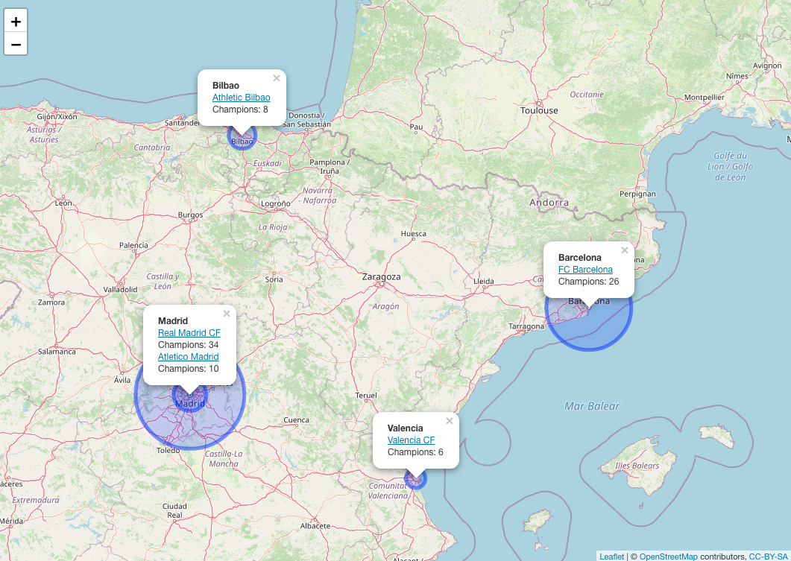

Final `.html` file knitted in October 16, 2020 (available in [`/output` folder](https://github.com/AU-R-Programming/HW3-Gabii/tree/main/output)): Source code available on [GitHub](https://github.com/AU-R-Programming/HW3-Gabii/blob/main/bonus/map.Rmd).

```{r chunksetup, include=FALSE}
knitr::opts_chunk$set(
   echo=TRUE, eval=TRUE, include=TRUE,
   warning=FALSE, message=FALSE,
   fig.align="center"
)
```

```{r clear_genv, echo=FALSE}
rm(list = ls())
```

```{css setup, echo=FALSE}

        .image {
                display: block;
                margin-left: auto;
                margin-right: auto;
                width: 60%;
        }

        .html-widget {
                margin: auto;
        }

```

<div style="text-align: justify">

### Using the leaflet and htmltools libraries (or others of your choice), create a simple map to represent the historical champions of La Liga. More specifically, the goal of this problem is to obtain the map below or something similar to:

</div>

<div class="image" id="example">

</div>

<div style="text-align: justify">

### The data needed for this graph is represented below:

| Team            | Champion | City      |
|-----------------|----------|-----------|
| Real Madrid     | 34       | Madrid    |
| FC Barcelona    | 26       | Barcelona |
| Atletico Madrid | 10       | Madrid    |
| Athletic Bilbao | 8        | Bilbao    |
| Valencia        | 6        | Valencia  |

\

</div>

Packages used in this assignment:

```{r install}

library(htmltools)
library(leaflet)
library(tidyverse)
library(ggmap)
library(sf)
library(knitr)

```

<div style="text-align: justify">

For me to be able to use the `sf` package to retrieve the coordinates data from the name of the cities provided, I needed to set up a API key to request and obtain such data from google. As I cannot expose the actual API key code here, I used it within my `R environment`, and loaded it as the variable "google_api_key", and registered it using the `register_google()` function:

</div>

```{r APIkey}
googlemaps_api_key = Sys.getenv("GOOGLEMAPS_API_KEY")

register_google(key = googlemaps_api_key)
```

<div style="text-align: justify">

I built a `tibble()` with the data of each column of the provided table: "Teams", "Champions", and "City". Then I unified them as a "bonus" `data.frame()`. All this seems strange, but it facilitates when using the package `sf`.

</div>

```{r tibbles_df}

Teams <- tibble(Teams = c("Real Madrid",
                          "FC Barcelona",
                          "Atlético Madrid",
                          "Athletic Bilbao",
                          "Valencia"))
Champions <- tibble(Champions = c(34,
                                  26,
                                  10,
                                  8,
                                  6))
City <- tibble(City = c("Madrid, Spain",
                        "Barcelona, Spain",
                        "Madrid, Spain",
                        "Bilbao, Spain",
                        "Valencia, Spain"))

bonus <- bind_cols(Teams, Champions, City)

# this goes to googlemaps and brings back the coordinates (lon, lat):
map <- mutate_geocode(bonus, City)

```

```{r view_tb_coords, echo=FALSE}
colnames(map) = c("Teams","Champions","City","Longitude","Latitude")
kable(map)
```

<div style="text-align: justify">

From here, I wanted to use the `sf` package, BUT I couldn't make it work knitting in html.! So once I had the coordinates, I build an object to each city, likewise:

</div>

```{r prep_map}

Barcelona <- paste(sep = "<br/>",
                 "<b>Barcelona</b>",
                 "<a href='https://www.fcbarcelona.com/en/'>FC Barcelona</a>",
                 "Champions: 26"
)

Madrid <- paste(sep = "<br/>",
                "<b>Madrid</b>",
                "<a href='https://www.realmadrid.com/en'>Real Madrid CF</a>",
                "Champions: 34",
                "<a href='https://en.atleticodemadrid.com/'>Atletico Madrid</a>",
                "Champions: 10"
)

Bilbao <- paste(sep = "<br/>",
                "<b>Bilbao</b>",
                "<a href='https://www.athletic-club.eus/en'>Athletic Bilbao</a>",
                "Champions: 8"
)

Valencia <- paste(sep = "<br/>",
                  "<b>Valencia</b>",
                  "<a href='https://www.valenciacf.com/en'>Valencia CF</a>",
                  "Champions: 6"
)

```

<div style="text-align: justify">

Next I just set up the popups with the information we just put in each object, relating it to their coordinates:

</div>

```{r map}

map <- leaflet() %>%
     addTiles() %>%
     addPopups(lng=-3.7037902, lat=40.41678, Madrid,
               options = popupOptions(closeButton = FALSE)) %>%
     addPopups(lng=2.1734035, lat=41.38506, Barcelona,
              options = popupOptions(closeButton = FALSE)) %>%
     addPopups(lng=-2.9349852, lat=43.26301, Bilbao,
               options = popupOptions(closeButton = FALSE)) %>%
     addPopups(lng=-0.3762881, lat=39.46991, Valencia,
               options = popupOptions(closeButton = FALSE))

```

<div class="image" id="example">

</div>

