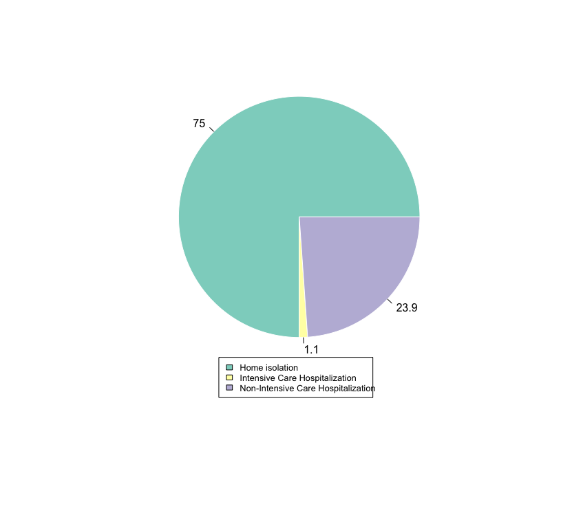

Final `.html` file knitted in October 16, 2020 (available in [`/output` folder](https://github.com/AU-R-Programming/HW3-Gabii/tree/main/output)): Source code available on [GitHub](https://github.com/AU-R-Programming/HW3-Gabii/blob/main/covid/covid.Rmd).!

```{r chunksetup, include=FALSE}
knitr::opts_chunk$set(
   echo=TRUE, eval=TRUE, include=TRUE,
   warning=FALSE, message=FALSE,
   fig.align="center"
)
```

```{r clear_genv, echo=FALSE}
rm(list = ls())
```

```{css, echo=FALSE}
 
  .image {
    display: block;
    margin-left: auto;
    margin-right: auto;
    width: 90%;
  }
```

<div style="text-align: justify">

### The "covid.csv" file contains data on Covid-19 cases in a province of Italy. For the following exercises, only provide first rows or elements in the output if the results are too large.

</div>

```{r install, echo=FALSE}
library(tidyverse)
library(knitr)
library(eeptools)
```

<div style="text-align: justify">

I made sure that the `.csv` file was in the same working directory as my project, so there was no file path in the command. I make the first row of the `raw_covid` data frame as the columns names, and the first column, as the rows names. I also re-named the "Epidemiological.link...Notes" column as "Notes", just for the sake of tidiness...

</div>

```{r import}

raw_covid <- read.csv(file = "covid.csv",
                      row.names=1,
                      header=TRUE)

colnames(raw_covid)[8] <- "Notes"

```

```{r view_raw, echo=FALSE}

glimpse(raw_covid)

```
\

<div style="text-align: justify">

### 1 and 2: Correctly format the dates in “Date.of.birth”, “First.day.of.symptoms”, “Date.of.outcome” and “Date.of.diagnosis”; Format “Hospitalization.type”, “Symptoms” and “Outcome” as factors and “Epidemiological.link…Notes” as character.

Because all modifications were in the same object, I made them using piping (`%>%`) and the `mutate` function for each type of modification. For the modifications in more than one variable, I used the `across` function applied to a vector of them.

</div>

```{r q1q2}

raw_covid <- raw_covid %>%
     mutate(across(c(Date.of.birth,
                     First.day.of.symptoms,
                     Date.of.outcome,
                     Date.of.diagnosis), as.Date)) %>%
     mutate(across(c(Hospitalization.type,
                     Symptoms,Outcome), as.factor)) %>%
     mutate(Notes = as.character(Notes))

```

```{r view_q1q2, echo=FALSE}

glimpse(raw_covid)

```
<div style="text-align: justify">
\

### 3: Create a three-dimensional table reporting the three factors from the previous question.

For this, I did not used the `table` function. Instead, I selected the data based on the class of the variable. To use said function, I would do something that looks like the `#commented` line below.
</div>

```{r q3}

q3 <- select_if(raw_covid, is.factor)

# q3 <- table(raw_covid[c("Hospitalization.type",
#                          "Symptoms",
#                          "Outcome")])

```

```{r view_q3, echo=FALSE}

glimpse(q3)

```
\

<div style="text-align: justify">

### 4: Using the table object created in the previous question, subset it in order to create the table presented in the homework assignment.

To be able to reproduce the table, I `filtered` the data to the set represented there. The whole table is only representing the data for the "Asymptomatic", and it does not represent the data that includes "Deceased" or "Non-Intensive care hospitalization". Once filtering all this, I could `group_by` the "Hospitalization Type" and "Outcome". This, summarized by the "Symptoms" column, gives us the counts for this overlap. In a separate piping, I use the function `spread` to move the "Outcome" values in a column based on the "Symptoms" values. Now, this looks like the table provided already, but because the `summarize` function did not provided a zero-value count, we need to `replace` the NA values for zero. This is long, and honestly can be done in like one line of subsetting, but I find it easier to understand and use when I know exactly what I'm taking out and modifying. Also, if I need to use the same function to extract different types of information, it is easier to change small bits. Like that, I can filter out different levels, or group by different variables.

</div>

```{r q4}

 q4 <- q3 %>%
      filter(Symptoms != "Symptomatic") %>%
      filter(Outcome != "Deceased") %>%
      filter(Hospitalization.type != "Non-Intensive care hospitalization") %>%
      group_by(Hospitalization.type, Outcome) %>%
      summarize(Symptoms = n())
 
 q4 <- q4 %>%
      spread(Outcome,Symptoms) %>%
      replace(is.na(.), 0)
 
```

```{r view_q4, echo=FALSE}

colnames(q4) <- c("","Disease in progress","Healed")
knitr::kable(q4, align = "c",
             format = "html",
             table.attr = "style='width:65%;'") %>%
        kableExtra::kable_styling(position = "center")

```
\

<div style="text-align: justify">

### 5: Order the data based on the date of diagnosis (from first to most recent).

</div>

```{r q5}

q5 <- arrange(raw_covid, Date.of.diagnosis)

```

```{r view_q5, echo=FALSE}

glimpse(q5$Date.of.diagnosis)

```
\

<div style="text-align: justify">

### 6: Add a column that reports whether or not a case was asymptomatic AND in home isolation. Name the observation “Home_Asymptomatic” if the conditions apply and “Non_Home_Asymptomatic” if not and then produce a bar plot of this new variable.

Here I used a `if` `else` sentence nested in a `for` loop to knowingly waste computational capacity, but also to train myself doing it without pain. Because this is not an extensive data set, the amount of time used is not that different than using another method, such as a `ifelse` statement in a `mutate()` function.

</div>

```{r q6}

df_q6 <- raw_covid %>%
   mutate(q6 = character(nrow(raw_covid)))

for (i in 1:nrow(df_q6)){
   if(isTRUE((df_q6[i,"Hospitalization.type"] == "Home isolation")
   && (df_q6[i, "Symptoms"] == "Asymptomatic"))) {
      df_q6[i,"q6"] <- "Home_Asymptomatic"
      } else {
      df_q6[i,"q6"] <- "Non_Home_Asymptomatic"
      }
}

```

```{r view_q6}

plot_q6 <- table(df_q6$q6)

barplot(plot_q6, xlab="Asymptomatic",
        names.arg=c("Home","Non-Home"),
        ylim=c(0,1000))
axis(2,at=seq(0,1000,200))

```
\

<div style="text-align: justify">

### 7: Count the number of cases of people born after 1981 and that have healed.

For questions 7 and 8 I used the same method: a piping with filters nesting the logical operators that fulfill the requirements. For question 7 I did not include people born during the year 1981, while for question 8 I did not include people born during the year 1982.

</div>

```{r q7}

q7 <- raw_covid %>%
     filter(Date.of.birth >= "1981-12-01") %>%
     filter(Outcome == "Healed") %>%
     summarize(n())

```

```{r view_q7, echo=FALSE}

colnames(q7) <- "Number of people born after 1981 and healed"
knitr::kable(q7, align = "c",
             format = "html",
             table.attr = "style='width:65%;'") %>%
        kableExtra::kable_styling(position = "center")
```
\

<div style="text-align: justify">

### 8: Count the number of cases that are asymptomatic OR in home isolation (but not both) AND were born before 1982.

</div>

```{r q8}

q8 <- raw_covid %>%
   filter(Date.of.birth <= "1982-01-01") %>%
   filter(xor(Symptoms == "Asymptomatic",
              Hospitalization.type == "Home isolation")) %>%
   summarize(n())

```

```{r view_q8, echo=FALSE}

colnames(q8) <- "Number of people born after 1982, Asymptomatic or in Home isolation"
knitr::kable(q8, align = "c",
             format = "html",
             table.attr = "style='width:65%;'") %>%
        kableExtra::kable_styling(position = "center")

```
\

<div style="text-align: justify">

### 9: Create a new dataset including only the rows where “Epidemiological.link…Notes” includes the words “contact” OR “symptom” (or both). Hint: you can use the grep() function and tolower().

Here I used the `tolower` function to make sure I will not mismatch due to differences on typing (even though it excludes typos!), in a `grepl()` function. I chose this instead of `grep()` because (the last does not work in this dataset and) `grepl()` returns a logical vector matching each element of my data frame.

</div>

```{r q9}

q9 <- raw_covid %>%
     filter(grepl("contact", tolower(Notes)) |
            grepl("symptom", tolower(Notes)))

```

```{r view_q9, echo=FALSE}

glimpse(q9)

```
\

<div style="text-align: justify">

### 10: In the previous dataset add a column reporting the age (in years, therefore in integer format) of each patient as of October 2nd, 2020. Save this dataset into a .csv file and make it available on your GitHub repository for this assignment.

I simplified the path for tidiness and privacy, and it follows an `glimpse` of what the "age" column looks like. The `.csv` file is available on the `/output` folder in the [GitHub repo](https://github.com/AU-R-Programming/HW3-Gabii/blob/main/output):

</div>

```{r q10, eval=FALSE}

q10 <- q9 %>%
   mutate("age" = floor(age_calc(q9$Date.of.birth,
                                 units = "years"))) %>%
   write.csv("covid_q10.csv")

```

```{r view_q10, echo=FALSE}

q10 <- q9 %>%
   mutate("age" = floor(age_calc(q9$Date.of.birth,
                                 units = "years")))

glimpse(q10$age)

```
\

<div style="text-align: justify">

### 11: Produce a pie chart for the type of hospitalization for cases born between 1960 and 1980.

I used again the piping with filters and logical operators to select the requested data and used the `base` pie type chart with the `RColorBrewer` package for prettier colors. I added the labels as percentages, simply calculating those in a separate object by hand, and added the names of the variables as a legend.

I kind of cheated to put the legend in the place that it shows in this document. Because of the length of the names, even if I surpass the nominal values for the argument position by playing with coordinates, I get the legend either on top of the pie, or cut off the chart area. The code I've actually used can be seen after the said plot.!

</div>

```{r q11}

q11 <- raw_covid %>%
   filter(Date.of.birth >= "1960-01-01" &
          Date.of.birth <= "1980-12-31") %>%
   filter(!is.na(Hospitalization.type))

```

```{r pie_q11, eval=FALSE}

library(RColorBrewer)

myPalette <- brewer.pal(3, "Set3") 
pie_q11 <- table(q11$Hospitalization.type)
piepercent <- round(100*pie_q11/sum(pie_q11), 1)

pie(pie_q11,
    labels=piepercent,
    main="Hospitalization type in cases born between 1960 and 1980 (%)",
    border="white",
    cex=0.7,
    col=myPalette)

legend("bottom",
       c("Home isolation",
         "Intensive Care Hospitalization",
         "Non-Intensive Care Hospitalization"),
       cex = 0.8,
       fill=myPalette)

```

  <div class="image" id="pie!">
  
  </div>

```{r pie_locator, eval=FALSE}  

# this first line creates the outer margin
# in my case, I wanted more space on the bottom, so c(5,0,0,0)
# if one would want more space on the left, c(0,5,0,0)
# this is a common fix for the legend position, as it gives you
# more space in general, but take a look at the code in legend()

par(xpd=T, mar=par()$mar+c(5,0,0,0))

pie(pie_q11,
    labels=piepercent,
    main="Hospitalization type in cases born between 1960 and 1980 (%)",
    border="white",
    col=myPalette)

# so this locator() function gives you a little arrow that you can
# click on your plot are and choose **exactly** where you want to put
# your legend. It is honestly probably not useful academically,
# when we are trying to make similar plots altogether, but it is pretty
# neat and cool!

legend(locator(1),
       inset=c(-0.2,0),
       c("Home isolation",
         "Intensive Care Hospitalization",
         "Non-Intensive Care Hospitalization"),
       cex = 0.8,
       fill=myPalette)

```


If not mentioned in the chunk, the packages used in this assignment were:

```{r obs, eval=FALSE}
library(tidyverse)
library(knitr)
library(eeptools)
```
